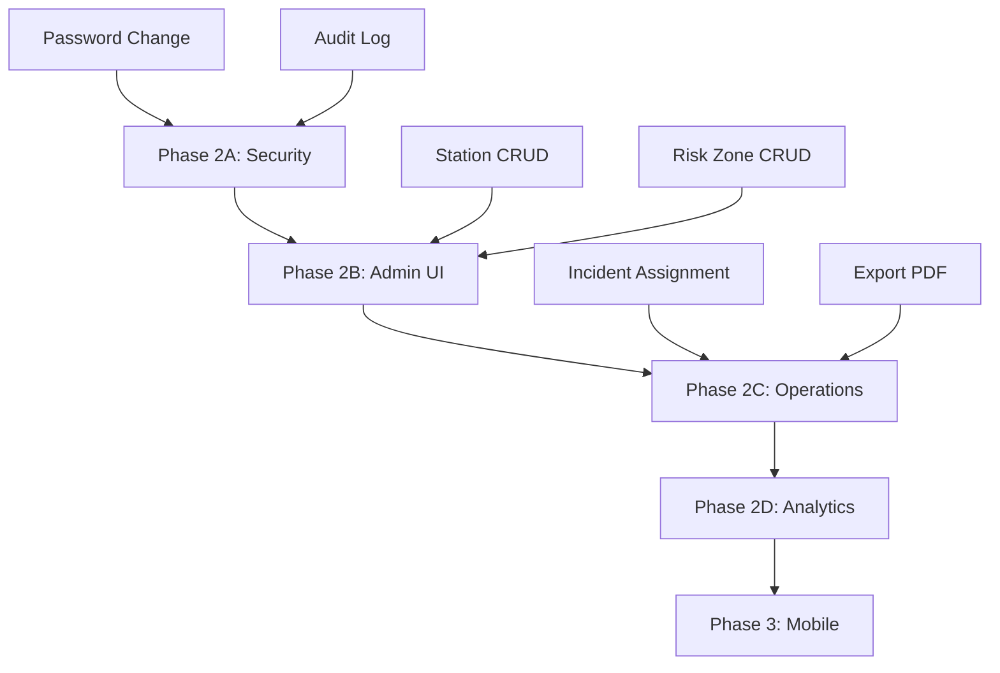

# 📊 C.O.P.S. Comprehensive System Analysis

**Date:** Jan 4, 2026  
**Version:** 1.1 (Post-Search Feature)

---

## 📈 Current System Status

### ✅ Completed Features (MVP)
| Feature | Status | Notes |
|---------|--------|-------|
| Authentication (JWT) | ✅ | Login/Logout working |
| User Management CRUD | ✅ | Admin can add/delete users |
| GPS Tracking (Patrol) | ✅ | Real-time location updates |
| Check-in System | ✅ | One-tap location stamp |
| Incident Reporting | ✅ | Photo upload + categories |
| Incident Resolution | ✅ | Close case button |
| Dashboard Map | ✅ | Live patrol markers |
| Risk Zone Display | ✅ | Circle overlays + colors |
| Notification Bell | ✅ | Real-time WebSocket alerts |
| **Map Search** | ✅ NEW | Geocoding + flyTo animation |
| **13 Police Stations** | ✅ NEW | Saraburi province data |

### 📊 Database Contents (After New Seed)
| Entity | Count |
|--------|-------|
| Bureau | 1 (ภ.1) |
| Province | 1 (สระบุรี) |
| Stations | **13** |
| Users | **11** |
| Risk Zones | **9** |

---

## 🔴 Priority 1: Security (Must-Have)

### 1.1 Password Change
**เหตุผล:** ผู้ใช้ต้องเปลี่ยนรหัสได้เอง
- [ ] หน้า Settings → Change Password
- [ ] Backend: `PATCH /api/auth/change-password`
- [ ] Force change on first login (optional)

**เวลา:** ~2 ชม.

### 1.2 Audit Log
**เหตุผล:** ตรวจสอบว่าใครทำอะไรในระบบ
- [ ] Log every: Login, Logout, Create User, Resolve Incident
- [ ] หน้า Admin → View Logs

**เวลา:** ~3 ชม.

---

## 🟡 Priority 2: Administration

### 2.1 Station Management UI
**เหตุผล:** Admin เพิ่ม/แก้สถานีผ่านหน้าเว็บ
- [ ] หน้า `/dashboard/stations` → CRUD
- [ ] Map picker for GPS coordinates
- [ ] Assign Province to Station

**เวลา:** ~4 ชม.

### 2.2 Risk Zone Management UI  
**เหตุผล:** กำหนดจุดเสี่ยงใหม่โดยวาดบน Map
- [ ] หน้า `/dashboard/riskzones/manage`
- [ ] Draw polygon/circle on map
- [ ] Set risk level + required check-ins

**เวลา:** ~5 ชม.

### 2.3 Hierarchy View
**เหตุผล:** ดูโครงสร้างองค์กรแบบ Tree
- [ ] หน้า `/dashboard/organization`
- [ ] Tree: Bureau → Province → Station → Users

**เวลา:** ~3 ชม.

---

## 🟢 Priority 3: Operations

### 3.1 Incident Assignment
**เหตุผล:** ผู้การมอบหมายงานให้สายตรวจ
- [ ] ปุ่ม "Assign" ในหน้า Incident
- [ ] Select patrol officer dropdown
- [ ] Status flow: Active → Assigned → In Progress → Resolved

**เวลา:** ~4 ชม.

### 3.2 Incident Comments
**เหตุผล:** พูดคุย/อัพเดทสถานะในแต่ละเคส
- [ ] Comment thread in incident detail
- [ ] Timestamp + commenter name

**เวลา:** ~3 ชม.

### 3.3 Export Reports (PDF/Excel)
**เหตุผล:** ส่งรายงานให้ผู้บังคับบัญชา
- [ ] ปุ่ม Export ในหน้า Incidents/Statistics
- [ ] PDF: สรุปรายวัน/รายเดือน
- [ ] Excel: รายการเหตุทั้งหมด

**เวลา:** ~4 ชม.

---

## 🔵 Priority 4: Analytics (Nice-to-Have)

### 4.1 Statistics Dashboard
- [ ] Chart: Incidents by type (Bar/Pie)
- [ ] Chart: Check-ins trend (Line)
- [ ] Heatmap: Incidents by time

**เวลา:** ~5 ชม.

### 4.2 Patrol History Playback
- [ ] Select patrol → See route on map
- [ ] Timeline slider

**เวลา:** ~4 ชม.

---

## ⚪ Priority 5: Future (Phase 3)

| Feature | Estimated Time | Notes |
|---------|----------------|-------|
| In-App Chat | ~8 ชม. | Commander ↔ Patrol messaging |
| Push Notifications | ~4 ชม. | Mobile browser notifications |
| Native Mobile App | ~60+ ชม. | Flutter/React Native |
| Offline Mode | ~10 ชม. | Queue actions when no network |
| Video Streaming | ~40+ ชม. | Bodycam live feed |

---

## 📅 Recommended Development Order

### Quick Wins (ทำได้เร็ว ผลกระทบสูง):
1. ✅ Password Change (~2h)
2. ✅ Export PDF (~3h)
3. ✅ Station CRUD (~4h)

---

## 🎯 Next Steps

**ถ้าต้องการดำเนินการต่อ เลือกได้เลย:**

1. 🔒 **Password Change** → เริ่มทำได้เลย
2. 🏢 **Station Management UI** → ให้ Admin จัดการสถานีเอง
3. 📄 **Export PDF** → ปริ้นรายงานได้

บอกผมว่าจะให้ทำอะไรก่อนครับ!
