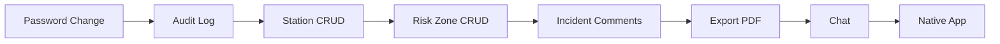

# 🗺️ C.O.P.S. Future Development Roadmap

**Current Status:** MVP Complete (v1.0)
**Analysis Date:** Jan 4, 2026

---

## 📊 Gap Analysis Summary

| Category | Current | Missing | Priority |
|----------|---------|---------|----------|
| **Administration** | User CRUD | Station/Zone CRUD, Bulk Import | 🟡 Medium |
| **Security** | JWT Auth | Password Change, 2FA, Audit Log | 🔴 High |
| **Operations** | Report + Resolve | Case Assignment, Comments, Workflow | 🟡 Medium |
| **Analytics** | Basic Stats | Export PDF/Excel, Charts, Trends | 🟡 Medium |
| **Communication** | Notification Bell | Chat, Push Notifications | 🟢 Low |
| **Mobile** | PWA Simulation | Native App (Flutter/React Native) | 🟢 Low |

---

## 🔴 Phase 2A: Security & Compliance (High Priority)

### 1. Password Management
**Why:** ความปลอดภัยของบัญชีผู้ใช้
- [ ] หน้า "เปลี่ยนรหัสผ่าน" (Settings Page)
- [ ] บังคับเปลี่ยนรหัสครั้งแรกหลัง Login
- [ ] รหัสผ่านหมดอายุทุก 90 วัน
- [ ] ตรวจสอบความแข็งแรงรหัสผ่าน (Strength Meter)

**Backend Changes:**
- Add `passwordChangedAt`, `mustChangePassword` to User model
- Create `PATCH /auth/change-password` endpoint

**Effort:** ~2-3 hours

---

### 2. Audit Log (บันทึกการใช้งาน)
**Why:** ตรวจสอบย้อนหลังได้ว่าใครทำอะไร
- [ ] บันทึกทุก Login/Logout
- [ ] บันทึกการสร้าง/แก้ไข User
- [ ] บันทึกการปิดงาน (Resolve Incident)
- [ ] หน้าดู Log สำหรับ HQ

**Backend Changes:**
```prisma
model AuditLog {
  id        String   @id @default(uuid())
  action    String   // LOGIN, LOGOUT, CREATE_USER, RESOLVE_INCIDENT
  userId    String
  targetId  String?
  details   Json?
  ipAddress String?
  createdAt DateTime @default(now())
}
```

**Effort:** ~3-4 hours

---

## 🟡 Phase 2B: Operational Improvements (Medium Priority)

### 3. Station & Risk Zone Management
**Why:** Admin ต้องเพิ่ม/แก้ไขสถานีและจุดเสี่ยงได้เอง
- [ ] CRUD หน้า "สถานี" (`/dashboard/stations`)
- [ ] CRUD หน้า "จุดเสี่ยง" (`/dashboard/riskzones/manage`)
- [ ] วาดพื้นที่บนแผนที่ (Polygon Drawing)
- [ ] กำหนดจำนวนครั้งที่ต้องเช็คอิน/วัน

**Frontend Changes:**
- New page: `app/dashboard/stations/page.tsx`
- Map component: Leaflet Draw plugin for zone creation

**Effort:** ~4-5 hours

---

### 4. Incident Workflow Enhancement
**Why:** ให้ผู้การฯ มอบหมายงานและ Comment ได้
- [ ] ปุ่ม "มอบหมายงาน" (Assign to Officer)
- [ ] ช่อง Comment/Reply ในแต่ละ Incident
- [ ] Status Flow: `ACTIVE` → `ASSIGNED` → `IN_PROGRESS` → `RESOLVED`
- [ ] Timeline ของแต่ละ Incident

**Backend Changes:**
```prisma
model IncidentComment {
  id         String   @id @default(uuid())
  incidentId String
  userId     String
  content    String
  createdAt  DateTime @default(now())
}

// Add to Incident model:
// assignedTo    String?
// status        IncidentStatus  // enum: ACTIVE, ASSIGNED, IN_PROGRESS, RESOLVED
```

**Effort:** ~4-5 hours

---

### 5. Export Reports (PDF/Excel)
**Why:** ส่งรายงานให้ผู้บังคับบัญชา
- [ ] ปุ่ม "Export" ในหน้า Statistics
- [ ] รูปแบบ PDF (สรุปรายวัน/รายเดือน)
- [ ] รูปแบบ Excel (รายการเหตุทั้งหมด)
- [ ] Scheduled Email Report (ส่งรายงานอัตโนมัติทุกวัน)

**Tech Stack:**
- PDF: `@react-pdf/renderer` or `puppeteer`
- Excel: `exceljs` or `xlsx`

**Effort:** ~3-4 hours

---

## 🟢 Phase 2C: Nice-to-Have Features (Low Priority)

### 6. In-App Chat
**Why:** สั่งการแบบเรียลไทม์
- [ ] Chat 1:1 ระหว่าง Commander กับ Patrol
- [ ] Group Chat ตามสถานี
- [ ] ส่งรูปภาพในแชท
- [ ] Push Notification เมื่อมีข้อความใหม่

**Tech:** Socket.io (มีอยู่แล้ว) + New Chat module

**Effort:** ~6-8 hours

---

### 7. Native Mobile App
**Why:** ประสบการณ์ดีกว่า PWA
- [ ] Migrate Patrol UI to Flutter/React Native
- [ ] Background GPS Tracking (ไม่ต้องเปิดหน้าจอ)
- [ ] Push Notifications (FCM)
- [ ] Offline Mode (Queue actions when no network)

**Tech:** Flutter (recommended) or React Native

**Effort:** ~40-60 hours (major project)

---

### 8. Advanced Analytics Dashboard
**Why:** วิเคราะห์แนวโน้มอาชญากรรม
- [ ] กราฟแนวโน้มรายสัปดาห์/เดือน
- [ ] Heatmap อาชญากรรมตามเวลา
- [ ] เปรียบเทียบระหว่างสถานี
- [ ] Predictive Analysis (ML)

**Tech:** Chart.js or Recharts, optional Python ML service

**Effort:** ~8-10 hours (without ML)

---

## ⏰ Recommended Development Order



**Quick Wins (ทำได้เร็ว, มีผลกระทบสูง):**
1. ✅ Password Change (~2h)
2. ✅ Export PDF/Excel (~3h)
3. ✅ Admin Station CRUD (~4h)

**Big Impact (ใช้เวลานาน, เปลี่ยนระบบครึ่งๆ):**
1. 🔷 Native Mobile App (~50h)
2. 🔷 Advanced Analytics with ML

---

## 💡 Recommendation

> **เริ่มจาก "Password Change" และ "Export PDF" ก่อน**
> เพราะผู้ใช้จะถามหาเป็นอันดับแรก และทำได้ภายในไม่กี่ชั่วโมง

หลังจากนั้นค่อยขยับไปทำ Station/Zone Management เพื่อให้ Admin จัดการข้อมูลเองได้โดยไม่ต้องพึ่ง Developer
