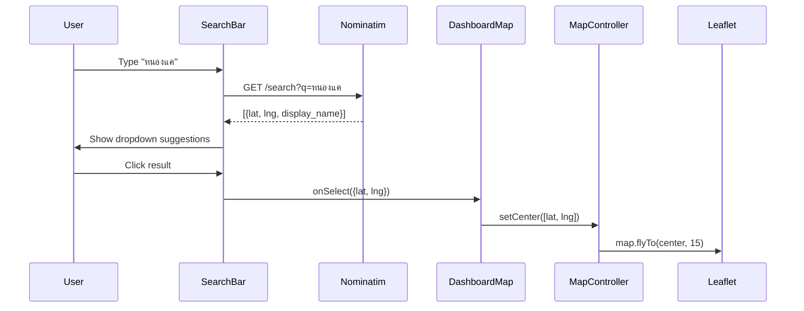

# 🗺️ Map Search & Filter Feature - Implementation Plan

## Goal
เพิ่มฟีเจอร์ค้นหาและกรองข้อมูลบนแผนที่ Dashboard ให้:
1. ค้นหาตำแหน่ง/สถานที่ → Map pan/zoom ไปยังตำแหน่งนั้น
2. กรองข้อมูลตาม: สถานี, จุดเสี่ยง, สายตรวจ
3. แสดง Popup/Card ข้อมูลของตำแหน่งที่เลือก

---

## Technical Approach

### Option A: Leaflet + Nominatim (Free, Recommended)
- **Geocoding:** ใช้ [Nominatim](https://nominatim.org/) API ของ OpenStreetMap (ฟรี)
- **Search UI:** React Autocomplete component
- **Pan/Zoom:** ใช้ `map.flyTo([lat, lng], zoom)` ที่มีอยู่แล้ว

### Option B: Google Maps API (Paid)
- ต้องเปลี่ยนจาก Leaflet ไป `@react-google-maps/api`
- ค่าใช้จ่าย ~$7 ต่อ 1,000 requests

> **Recommended:** Option A (Nominatim) - ฟรี + ใช้เทคโนโลยีที่มีอยู่

---

## Proposed Changes

### 1. New Component: `MapSearchBar.tsx`
```tsx
// Features:
// - Input field with autocomplete
// - Quick filter buttons (Stations, Risk Zones, Patrols)
// - On select: callback with {lat, lng, name}
```

### 2. Modify: `DashboardMap.tsx`
```diff
+ import MapSearchBar from './MapSearchBar';

+ const handleSearchSelect = (location) => {
+   setCenter([location.lat, location.lng]);
+   setSelectedItem(location);
+ };

  return (
    <div className="relative h-full">
+     <MapSearchBar onSelect={handleSearchSelect} />
      <MapContainer ...>
```

### 3. New API: Geocoding Helper
```typescript
// lib/geocoding.ts
export async function searchLocation(query: string) {
  const res = await fetch(
    `https://nominatim.openstreetmap.org/search?format=json&q=${encodeURIComponent(query)}&countrycodes=th&limit=5`
  );
  return res.json();
}
```

---

## UI Design

```
┌─────────────────────────────────────────────────────────────┐
│ [ 🔍 ค้นหาสถานที่... ] [สถานี▼] [จุดเสี่ยง▼] [สายตรวจ▼]   │
├─────────────────────────────────────────────────────────────┤
│                                                             │
│                      🗺️ MAP                                 │
│                                                             │
│         ┌──────────────────┐                                │
│         │ 📍 Selected Info  │                                │
│         │ Name: xxx         │                                │
│         │ Status: Active    │                                │
│         └──────────────────┘                                │
└─────────────────────────────────────────────────────────────┘
```

---

## Data Flow



---

## Filter Logic

| Filter Type | Data Source | Action |
|-------------|-------------|--------|
| Station | `/api/organization/stations` | flyTo station coords |
| Risk Zone | `/api/riskzones` | flyTo zone + highlight circle |
| Patrol | `/api/tracking/active` | flyTo patrol's last location |

---

## Effort Estimate

| Task | Time |
|------|------|
| `MapSearchBar.tsx` component | ~2 hours |
| Geocoding helper | ~30 min |
| Integrate with `DashboardMap` | ~1 hour |
| Filter dropdowns | ~1.5 hours |
| Selected item info panel | ~1 hour |
| **Total** | **~6 hours** |

---

## Next Steps

1. [ ] Create `lib/geocoding.ts`
2. [ ] Create `components/MapSearchBar.tsx`
3. [ ] Modify `DashboardMap.tsx` to accept search/filter
4. [ ] Add filter dropdowns for Stations/Zones/Patrols
5. [ ] Add info panel for selected location
