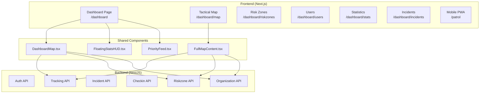

# C.O.P.S. System Analysis - Map Components & Architecture

## Current Screenshot Analysis


**Working Features (✅):**
- God's Eye View layout with full-screen map
- Floating Stats HUD (สายตรวจ 0, เช็คอิน 0, เหตุการณ์ 0, จุดเสี่ยง 26, LIVE)
- Map Legend panel (top-right)
- Priority Feed panel (bottom-right)
- Station markers (blue icons)
- Risk zones (red/orange circles)
- User profile (top-right)

---

## 🔴 Duplicate Map Components Detected

| Component | Location | Lines | Purpose |
|-----------|----------|-------|---------|
| `DashboardMap.tsx` | components/ | 496 | Main dashboard map |
| `FullMapContent.tsx` | components/ | 688 | Tactical map page |

### Shared Code (Duplicated):

| Function | DashboardMap | FullMapContent | Notes |
|----------|--------------|----------------|-------|
| `createStationIcon()` | ✅ | ✅ | Nearly identical |
| `createPatrolIcon()` | ✅ | ✅ | Nearly identical |
| `getRiskColor()` | ✅ | ✅ | Identical |
| `MapController` | ✅ | ✅ | Identical |
| `ZoomHandler` | ✅ | ✅ | Identical |
| `fetchData()` | ✅ | ✅ | Same APIs called |
| Data state (patrols, stations, riskZones) | ✅ | ✅ | Same structure |

### Unique Features:

| Feature | DashboardMap | FullMapContent |
|---------|--------------|----------------|
| GeoJSON Province Boundaries | ❌ | ✅ |
| Province Filter Dropdown | ❌ | ✅ |
| Bureau Filter Dropdown | ❌ | ✅ |
| Province Name Mapping (77 provinces) | ❌ | ✅ |
| Search Bar | ✅ | ✅ |
| flyToLocation Event Listener | ✅ | ❌ |

---

## 📍 Map Pages Structure

```
/dashboard          → Uses DashboardMap.tsx (God's Eye View)
/dashboard/map      → Uses FullMapContent.tsx (Tactical Map with filters)
```

**Problem:** Two separate map implementations with ~60% code overlap.

---

## 🎯 User Requirements vs. Current State

| Requirement | Current State | Status |
|-------------|---------------|--------|
| God's Eye View (Full-screen map) | ✅ Implemented | ✅ Done |
| Floating HUD Stats | ✅ Implemented | ✅ Done |
| Priority Feed with Auto-fly | ✅ Implemented | ✅ Done |
| Collapsible Sidebar | ✅ Already exists | ✅ Done |
| Command Hierarchy Filter (Country→Bureau→Province→Station) | 🟡 Partial (FullMapContent has Bureau/Province) | 🟡 In Progress |
| Threat Category Toggles (Blue/Red Force) | ❌ Not implemented | ❌ Todo |
| Time Dimension (Live vs Historical) | ❌ Not implemented | ❌ Todo |
| Heatmap/Cluster at Country level | ❌ Not implemented | ❌ Todo |

---

## 🛠️ Refactoring Recommendations

### Option A: Merge into Single Component (Recommended)
Create a unified `TacticalMap.tsx` that handles both use cases:

```
components/
├── map/
│   ├── TacticalMap.tsx       # Main unified component
│   ├── MapIcons.ts           # Shared icon factories
│   ├── MapFilters.tsx        # Province/Bureau/Threat filters
│   ├── MapLegend.tsx         # Legend panel
│   └── MapHUD.tsx            # Floating stats overlay
```

**Benefits:**
- Single source of truth for map logic
- Easier to maintain
- Consistent behavior across pages
- Reduced bundle size (~500 lines saved)

### Option B: Extract Shared Utilities
If keeping separate components is preferred:

```typescript
// lib/mapUtils.ts
export { createStationIcon, createPatrolIcon, getRiskColor }
export { MapController, ZoomHandler }
```

---

## 📊 Current System Overview



---

## ✅ Next Steps (Recommended Priority)

1. **[LOW]** Refactor map components to eliminate duplication
2. **[MEDIUM]** Add Threat Category toggles (Blue Force/Red Force)
3. **[MEDIUM]** Implement Time Dimension switch (Live/Historical)
4. **[HIGH]** Add Command Hierarchy drill-down (Cluster → Bureau → Province → Station)
5. **[LOW]** Consolidate `/dashboard` and `/dashboard/map` into single page

---

## 🔧 Quick Fix: Sidebar Menu Update

The sidebar has "แผนที่ยุทธวิธี" pointing to `/dashboard/map`, but the main `/dashboard` now also has a full tactical map. Consider:

1. Remove `/dashboard/map` menu item (since Dashboard IS the map now)
2. OR rename Dashboard to "Command Center" and keep Map page for filtered view
